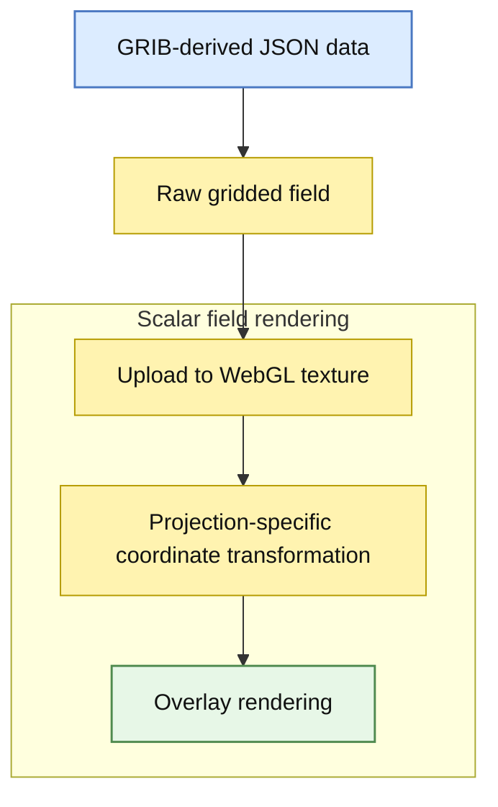

# react-earth

This project is a React and TypeScript reimplementation of the brilliant [Cambecc/earth](https://github.com/cambecc/earth) project created by Cameron Beccario.

The data visualization logic remains largely the same and relies on SVG/D3, webGL and canvas for rendering.

This project was sponsored by the Japan Agency for Marine-Earth Science and
Technology (JAMSTEC), which studies climate and works on forecasting it.

## Architecture

- React handles UI and application state.
- d3-geo computes projections and map geometry.
- WebGL renders the scalar data overlay.

## Data flow

The application works with gridded meteorological data provided in JSON form and derived from GRIB files.  
Each grid point stores either a scalar value or two components `(u, v)` when the field is a vector field, for example for wind.

### Overlay rendering

The raw data are uploaded directly to a WebGL texture and used to render the overlay.  
The rendering pipeline depends on the selected projection.

For the orthographic projection, the overlay is drawn on a sphere mesh, whereas for the equirectangular projection it is drawn on a screen-aligned quad.

1. Mesh UV coordinates or screen positions (depending on the projection) are converted to longitude/latitude.
2. Longitude/latitude are converted to spherical coordinates.
3. The current rotation is applied to the sphere.
4. The rotated point is projected to screen space (orthographic) or converted back to `(lon', lat')` (equirectangular).

In both cases, the displayed color is obtained from the original gridded dataset after applying the current projection and rotation.

## Grid data format

Meteorological fields are provided as gridded datasets derived from GRIB files and stored in JSON format.  
Each dataset is represented as an array of objects describing the grid values and its spatial metadata.

Each object should contain:

- `data`: a flat array of numeric values representing the field sampled on a regular grid,
- `header`: metadata describing the grid geometry
  - `nx`, `ny`: number of grid points along the longitude and latitude directions,
  - `lo1`, `la1`: longitude and latitude of the first grid point,
  - `dx`, `dy`: spacing between grid points in longitude and latitude.

If the field is scalar (for example temperature), the array contains a single object.  
If the field is a vector field (for example wind), then the array should contain two objects representing the two vector components
(typically the zonal `u` and meridional `v` components).

No datasets are provided by this repository for the moment.  
However, real meteorological data can be obtained from the [Global Forecast System](http://en.wikipedia.org/wiki/Global_Forecast_System) (GFS, operated by the US National Weather Service) and forecasts can be downloaded from [NOMADS](http://nomads.ncep.noaa.gov/).
