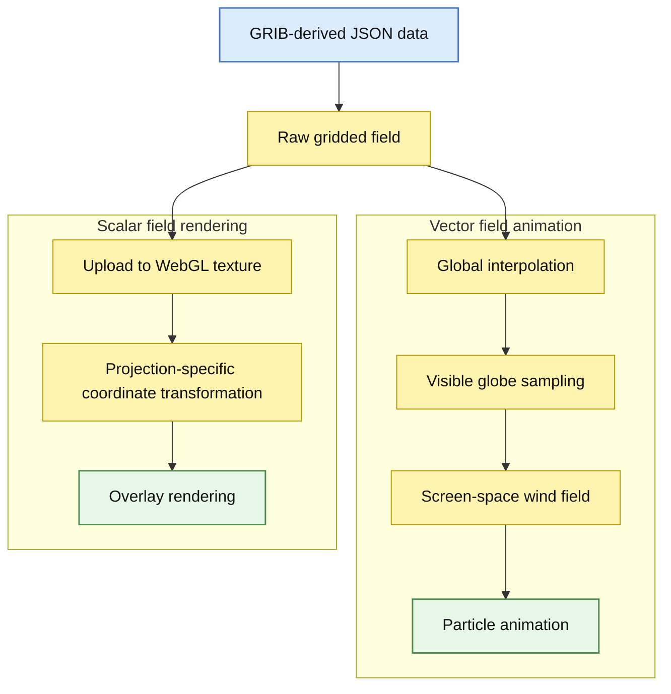

# react-earth

This project is a React and TypeScript reimplementation of the brilliant [Cambecc/earth](https://github.com/cambecc/earth) project created by Cameron Beccario.


The data visualization logic remains largely the same and relies on SVG/D3, WebGL and canvas for rendering.

This project was sponsored by the Japan Agency for Marine-Earth Science and
Technology (JAMSTEC), which studies climate and works on forecasting it.

## Architecture

- React handles UI and application state.
- d3-geo computes projections and map geometry.
- WebGL renders the scalar data overlay.
- Canvas is used for particle-based vector field animation.

## Installation & basic usage

First, install the library in your React project:

```bash
npm install react-earth
```

Then use the Earth component in your application:

```tsx
import Earth, { GlobeController } from "react-earth";
import "react-earth/dist/index.css";

const globeController = new GlobeController();

const Component = () => (
  <Earth
    globeController={globeController}
    projection="ortho"
    overlayToolBox={overlayToolBox}
    getColor={getColor}
  />
);
```

`overlayToolBox` should contain the gridded scalar or vector field data to render on the globe and
`getColor` is a function that maps a field value from `overlayToolBox` to the color used for rendering.

For a more complete example, including data loading, streams, markers, and compare mode, see the
demo application in the demo directory.

## Data flow

The library works with gridded meteorological data provided in JSON form and derived from GRIB files.  
Each grid point stores either a scalar value or two components `(u, v)` when the field is a vector field, for example for wind.



### Overlay rendering

The raw data are uploaded directly to a WebGL texture and used to render the overlay.  
The rendering pipeline depends on the selected projection.

For the orthographic projection, the overlay is drawn on a sphere mesh, whereas for the equirectangular projection it is drawn on a screen-aligned quad.

1. Mesh UV coordinates or screen positions (depending on the projection) are converted to longitude/latitude.
2. Longitude/latitude are converted to spherical coordinates.
3. The current rotation is applied to the sphere.
4. The rotated point is projected to screen space (orthographic) or converted back to `(lon', lat')` (equirectangular).

In both cases, the displayed color is obtained from the original gridded dataset after applying the current projection and rotation.

### Vector field and particles animation

When the dataset represents a vector field, such as wind, additional processing is performed to animate moving particles.

1. The application builds an interpolation function over the full globe from the raw grid data.  
   This allows the vector field to be evaluated continuously, including between original grid points.

2. For the current view, the visible portion of the globe is computed and sampled to generate a screen-space wind field.  
   For each visible point, the local vector value is evaluated and stored for animation.

3. Particles are initialized at random positions, with random lifetimes, over the currently visible region.

4. At each animation step, a particle is advected by the local vector field:
   - if it remains in the visible field, it is drawn and moved forward,
   - if it leaves the visible region, or if no valid motion is available, it is discarded,
   - when a particle dies, a new one is spawned to replace it.

This particle system produces the animated flow effect visible on top of the map.

## Grid data format

Meteorological fields are provided as gridded datasets derived from GRIB files and stored in JSON format.  
Each dataset is represented as an array of objects describing the grid values and their spatial metadata.

Each object should contain:

- `data`: a flat array of numeric values representing the field sampled on a regular grid,
- `header`: metadata describing the grid geometry
  - `nx`, `ny`: number of grid points along the longitude and latitude directions,
  - `lo1`, `la1`: longitude and latitude of the first grid point,
  - `dx`, `dy`: spacing between grid points in longitude and latitude.

If the field is scalar (for example temperature), the array contains a single object.  
If the field is a vector field (for example wind), then the array should contain two objects representing the two vector components
(typically the zonal `u` and meridional `v` components).

No datasets are provided by this repository at the moment.  
However, real meteorological data can be obtained from the [Global Forecast System](http://en.wikipedia.org/wiki/Global_Forecast_System) (GFS, operated by the US National Weather Service) and forecasts can be downloaded from [NOMADS](http://nomads.ncep.noaa.gov/).

## Development

Run the library watcher and demo app:

```bash
git clone https://github.com/JAMSTEC-SPDX/react-earth
cd react-earth
npm install
npm run dev
```

## Current status

The API is still evolving and may change before the first stable release.
